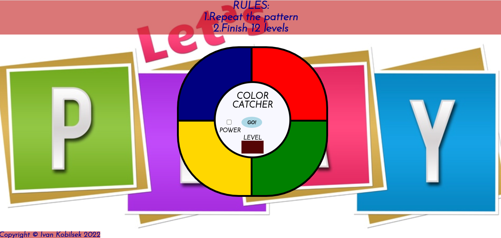

# Color Catcher

Based on the famous electronic game of memory skill  invented in 1978. The game is for all ages and it works by highlighting buttons in a random sequence incrementing the level by 1 each time the player repeat the correct order. The game is won by completing all 12 levels.

## UX

### Project Purpose

The goal of the Color Catcher game is to test and train memory skills and also provide a fun for everyone.

### User stories

- As a user I am presented with 4 different colours-panels: (navy, red, yellow and green)
- When I click power button game turns on and says "HI!" to me
- When I press GO! button game starts flashing and also its showing me that I am on level 1
- Each time I get the sequence right level increments by 1 and the pattern repeats with an added random button.
- When I make a mistake, the game informs me of it saying NO! and the whole pattern repeats, allowing me to try again endlessly
- When I get the sequence right for 12 levels, I am informed I won the game and I can start all over again 

## Features

- 4 buttons (navy, red, yellow, green)
- 12 levels
- Power button to turn on the game
- GO button to start the game
- After every mistake the computer sequence is repeated so player can try again
- Level counter
 

 

# Technologies

- [HTML5](https://en.wikipedia.org/wiki/HTML5)
  - Used to structure page content
- [CSS](https://en.wikipedia.org/wiki/Cascading_Style_Sheets)
  - Used for the page presentation
- [JavaScript](https://en.wikipedia.org/wiki/JavaScript)
  - Used to produce game logic
- [GitHub](https://github.com/)
    - Github is used: 
    1. As a remote code backup which is used in the project.
    2. As a remote server for all users to see the code which is used in the project.
    3. For users to view the deployed version of the website. The deployed version can be viewed [HERE!](https://koby1705.github.io/color-catcher/).

 

# Testing

## Manual testing

- Numerous manual tests were done to ensure that the website is working with it's intended purpose and use
- The website was tested numerous times in Browsers: Chrome, Safari, FireFox and Internet Explorer

## Automated testing

- No errors were found when passing through the official
  

  
W3C Validator

  - [index.html](https://validator.w3.org/nu/?doc=https%3A%2F%2Fkoby1705.github.io%2Fcolor-catcher%2Findex.html)
  

- No errors were found when passing through the official

  

  
W3C CSS Validator

  - [style.css](https://jigsaw.w3.org/css-validator/validator?uri=https%3A%2F%2Fkoby1705.github.io%2Fcolor-catcher%2F&profile=css3svg&usermedium=all&warning=1&vextwarning=&lang=en)
  

- No errors were found when passing through the official

  

  
JSHint Code Quality Tool

  - [script.js](https://jshint.com/)
  

 

# Bugs

- Not completely responsive under 400px, left side of the quadrants is cut off by few px on mobile devices

  

# Deployment

The site was deployed to Github pages using the following steps:

- In the Github repository, click on the Settings tab.
- Scroll down and click Pages from the left side navigation menu.
- From the Source section drop-down menu, select the Main Branch
- Once the main branch has been selected, the page will be automatically refreshed with a detailed ribbon display with the successful deployment message: Your site is published at https://koby1705.github.io/color-catcher/

 

# Credits

I would like to thank Matt Bodden from Slack community who pointed out to me to identify the problem with using square bracket notation while getting element by class name

## Content

- All text was written by myself

## Code

- Inspiration for the game was taken from few sources [Youtube.com](https://www.youtube.com/watch?v=FEL8gKaIm1Y) & [Youtube.com](https://www.youtube.com/watch?v=W0MxUHlZo6U&t=672s) & [Youtube.com](https://www.youtube.com/watch?v=n_ec3eowFLQ&t=3416s)
- Most of the code was learnt from [www.codeinstitute.net](https://www.codeinstitute.net)
- One more great site to mention where a lot of good curriculum could be found is [W3Schools](https://www.w3schools.com/)